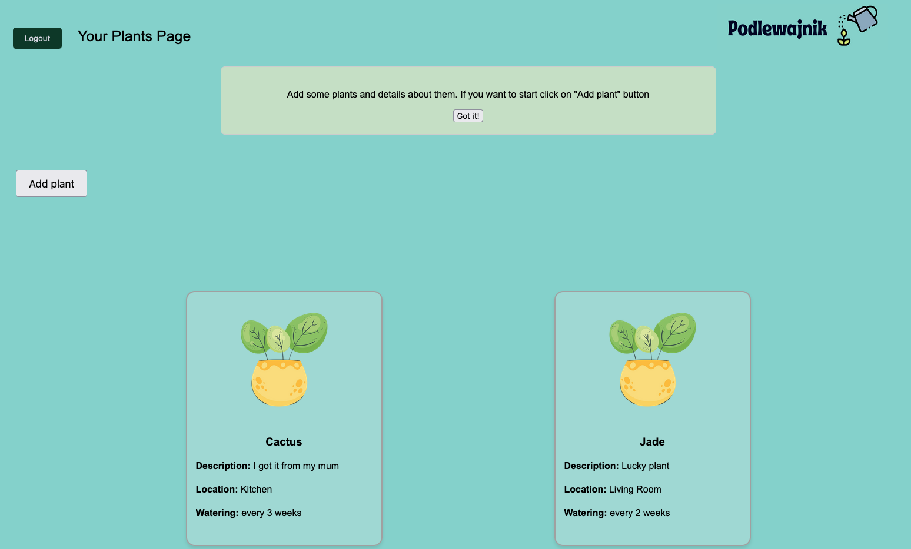

# podlewajnik

Podlewajnik (eng. Watering) is a self-development project with the primary goal of learning how to write automated tests using the Playwright framework. 

## Functionalities:
- Registration
- Login
- List of plants
- Adding new plants
- Editing plants
- Deleting plants

## Known Issues:
- Editing plants (backend issues, to be fixed)
- Deleting plants (backend issues, to be fixed)
- Navigation
- Skipped tests
- Tests that run with the Playwright plugin but don’t work with the npm command

## Future Developments:
- Calendar of watering
- Picture upload
- Email reminders about watering

## Screenshots

#### Landing page

#### Register page

#### Main page

#### Plant modal

## Development

See `README.md` files in both `podlewajnik_backend` and `polewajnik_frontent` for instructions how to run both services.
